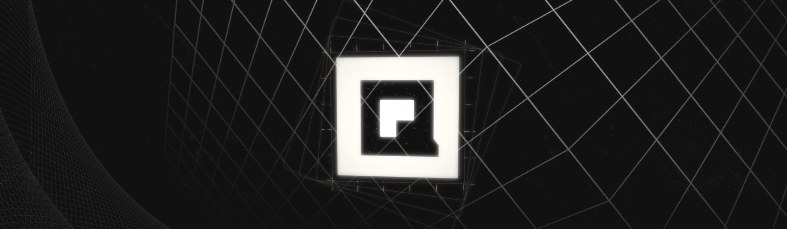

<figure><figcaption></figcaption></figure>

# VeriQ

## Securing Blockchain for the Quantum Era

VeriQ is a decentralized defense platform that prepares blockchain ecosystems for the quantum computing era. Built on **BNB Smart Chain**, VeriQ combines quantum simulation, decentralized compute, and blockchain-based verification to protect the infrastructure that powers decentralized finance.

> The first decentralized platform built specifically to defend against quantum threats — combining audits, mining optimization, and a marketplace in one ecosystem.

---

### What is VeriQ?

As quantum computing advances, the cryptographic systems securing blockchain networks face real and growing risk. VeriQ bridges the gap between blockchain and quantum computing so that decentralized systems can thrive in a post-quantum world.

**$VQ** is the native utility token powering the VeriQ ecosystem.

| | |
|---|---|
| **Token** | $VQ |
| **Network** | BNB Smart Chain (BEP-20) |
| **Launch** | 100% Fair Launch via four.meme |
| **Tax** | 0% Buy / 0% Sell |
| **Liquidity** | Burned |
| **Contract** | Renounced |

---

### Quick Navigation

* [Executive Summary](executive-summary.md)
* [The Quantum Threat](quantum/the-quantum-threat.md)
* [Platform Architecture](platform/architecture.md)
* [Key Features](platform/features.md)
* [Tokenomics](tokenomics.md)
* [Roadmap](roadmap.md)
* [Official Links](official-links.md)
