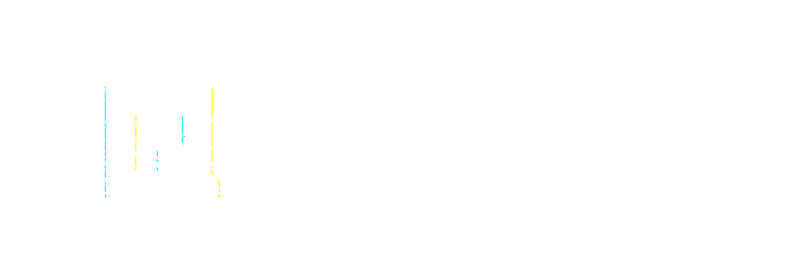

<figure><figcaption></figcaption></figure>

# Key Features

## Quantum Vulnerability Audits

Simulate quantum attacks against blockchain cryptographic infrastructure to identify vulnerabilities before they can be exploited.

- Simulate Shor's algorithm against ECDSA key parameters
- Assess key size resilience and time-to-break estimates
- Generate vulnerability reports with migration priorities

---

## Smart Contract Security

Test smart contracts for quantum-vulnerable patterns.

- Signature verification scheme analysis
- Cryptographic hash dependency mapping
- Key derivation and storage pattern review

---

## Post-Quantum Mining Protection

Quantum-optimized mining strategies to future-proof blockchain validation operations.

- Mining operation analysis against quantum-class computation
- Energy and efficiency optimization using quantum-inspired algorithms
- Quantum-resistant strategy recommendations

---

## Global Quantum Compute Marketplace

A decentralized marketplace connecting quantum compute providers with consumers.

| Role | What You Do |
|---|---|
| **Providers** | Supply quantum hardware or simulation capacity, earn $VQ |
| **Consumers** | Submit compute tasks, pay with $VQ via smart contract escrow |
| **Verifiers** | Stake $VQ, verify computation integrity, earn rewards |

---

## Developer Tools

- **SDKs & APIs** — Integrate VeriQ's quantum audit capabilities into your own applications
- **Qiskit & Cirq Integration** — Leverage established quantum frameworks
- **Staking & Governance** — Participate in network security and platform direction
